如何根据爆口特征判断爆管原因

# 四管爆漏的种类和定义

根据其产生的原因不同, 可以按表 1 分类。

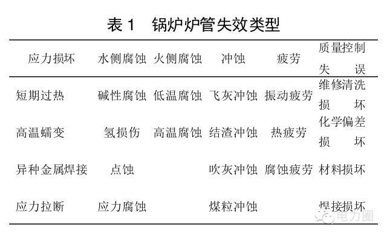

# 爆口特征判断法

爆口特征主要是指：

（1）爆口位置 : 位于何种受热面的具体部位是向火侧还是背火侧。

（2）爆口形状

- 1）断口面是否垂直于轴向 ;
- 2）爆口边缘有无明显变薄情况, 是锐边还是钝边;
- 3） 爆口内壁有无积垢 ,外壁氧化情况 ,爆口附近宏观裂纹 ;
- 4）爆口附近内外壁有无明显的腐蚀坑;
- 5）爆口附近内外壁上的裂纹走向 。

（3） 爆口附近的金相：包括相的组成 、数量、形态、大小和分布 ,以及各类金相裂纹( 性质、大小、形态、走向及其与显微组织的关系等), 显微孔洞的大小和分布,珠光体球化程度和石墨化程度 , 脱碳、过烧 、过热等。

## 过热爆管

过热可分短期过热和长期过热两大类 。

### 长期过热

> 长期过热爆管通常爆口不大 , 破口断面粗糙而不平整 ,管壁减薄不多 ,破口边缘是钝边 , 并不锋利 , 破口附近有众多的平行于破口的管子轴向裂纹 。
>
> 由于长期在高温下运行 , 爆口附近往往有较厚的黑色氧化皮 。从蠕变原理上来说 , 破口应为塑性断裂 ,但蠕变爆管往往伴有应力腐蚀 , 这使爆口表现出脆性断裂的特征 。
>
> 当管子过热时 , 管子会以加快了的蠕变速度发生管径胀粗 ,通常在爆口的金相图中可以看到明显的蠕变晶间裂纹 ,伴随有严重的球化现象 。
>
> 由于长期在高温下运行 ,在裂纹发展的同时 , 也发生裂纹内部的氧化 , 结果在裂纹内壁上生成了氧化层 , 尤其是粗大的蠕变裂纹处 ,其氧化层更为明显 。

### 短期过热

> 短期过热是由于管子在严重超温的情况下力学性能严重下降 ,管子在压力的作用下发生塑性变形以至爆破 。短期过热爆管按过热程度的高低又可分为 : （1）瞬时过热爆管 , 温度在 Ac3 以上 ; （2）短期直接过热爆管 ; （3）小鼓包爆管 。
>
> 瞬时过热爆管破口处呈喇叭状 , 管子严重减薄胀粗 ,边缘锋利 , 为韧性断裂 , 外表呈蓝黑色氧化组织 。破口的内壁由于管内汽水混合物急剧冲出 , 因此显得十分光洁 ,管子胀粗严重 。管子外壁一般呈蓝黑色 ; 破口附近没有众多平行于破口的轴向裂纹 , 破口处的组织为羽毛状贝氏体组织 。
>
> 短时直接过热爆管的爆口很大 , 外形上呈不规则菱形 ,显微组织碳化物球化 , 破口边较锋利 , 破口附近有一定的胀粗并且在离破口较远处管子也有不同程度的胀粗 。破口组织为铁素体加块状珠光体 , 珠光体已有一定程度的球化 。
>
> 小鼓包爆管是局部过热爆破 , 未爆破部位胀粗不明显 ,破口处有明显的小鼓包 , 破口也较锐利 、光滑 。破口组织为铁素体加块状珠光体 , 珠光体已有一定程度的球化 ,晶界上也有渗碳体球。

## 磨损爆管

磨损爆破口的爆口特征是爆口附近管壁有明显的减薄 ,爆口金相无明显变化 , 属于韧性破裂 , 爆破边缘呈薄形 。

受热面磨损引起四管爆破 ,因磨损机理的不同 ,可以分为以下几类 :

( 1) 飞灰磨损 ;

飞灰磨损是造成低温受热面磨损 、泄漏 、爆管的最重要原因之一 。试验表明 , 对于碳钢表面 , 冲击角为30° ～ 50° 的部位磨损最严重 , 会在管壁表面造成一个磨损棱角 。同时在锅炉中 , 飞灰磨损造成低温受热面爆管主要是因为该处存在烟气走廊 。

( 2) 机械磨损 ;

机械磨损的产生原因是受热面管排上的管卡常会因过热变形或焊接不牢固而开焊 , 造成管子振动并与管卡相磨 ,或者水冷壁与其他相邻部件有撞击或摩擦 ,使管壁磨损减薄 ,当管壁减薄到一定程度时 , 在内压的作用下 ,管子发生爆破 。因此 ,可在管子表面发现有明显的机械摩擦痕迹 。

( 3) 吹灰磨损 ;

吹灰器的投入 ,会造成管壁磨损问题 。吹灰磨损的外形与飞灰磨损较为相象 , 管壁的金相也相似 , 通常只是机械性磨损 , 发生塑性破坏 , 管壁磨损处明显减薄 。一般发生磨损爆管的地方都位于吹灰器的吹灰管排处 。

( 4) 煤粒磨损 ;

煤粒磨损一般是由于三次风嘴( 或主火嘴) 烧坏变形 ,带粉气流冲刷到周围水冷壁而造成的 。对于煤粒磨损 ,其破口特征为 : 爆口沿向火面中心线一侧的壁厚最薄处开裂 ,然后以向火面另一侧为轴呈掀开状 。爆口边缘呈刀刃状 ,一端撕裂 , 爆破管及两侧管无胀粗 、鼓包 。向火面中心线一侧严重磨损减薄 , 爆口附近管可能有结渣现象 。爆口边缘及相邻管向火侧的金相组织变化不大 ,爆口边缘的铁素体晶粒无明显拉长现象 ,说明水冷壁爆破时塑性变形不大 。

( 5) 掉渣磨损

落焦造成磨损实例较少 ,发生后会在冷灰斗斜面上产生点状穿孔泄漏

## 腐蚀爆管

由于外部介质与受热面管子发生化学作用或电化学作用而引起的爆管称为腐蚀爆管 。虽然腐蚀爆管占总爆管数的比例较低 , 但由于具有突发性和不可预测性 ,腐蚀一旦发生 , 受损范围较大 , 往往造成大面积的受热面损坏 。

爆管按腐蚀发生的部位 ,可分为烟气侧腐蚀和水侧腐蚀爆管 。

### 烟气侧腐蚀

烟气侧腐蚀又因产生的部位和条件不同 ,可分为高温腐蚀和低温腐蚀 。当燃用高水分高硫燃料时 ,高温受热面管子受到腐蚀 ,称为高温腐蚀 。低温腐蚀则是指尾部低温受热面所受到的腐蚀 。

1.高温腐蚀

由烟气侧高温腐蚀而引起的爆管 , 有以下几种腐蚀机理：

- （1） SO2 、SO3 、H2S 等腐蚀性气体作用；
- （2）硫酸盐型的高温腐蚀机理；
- （3）硫化物型的高温腐蚀机理。

在破口附近可清楚地辨认出一大片腐蚀区 , 腐蚀区凹凸不平; 在破口附近管壁减薄, 爆口呈拉裂状 ,裂口较长。

腐蚀爆管与磨损爆管的区别在于: 磨损爆管附近管壁很光滑,并有一个磨损的棱角 ,而腐蚀爆管附近则凹凸不平 ,无明显的棱角存在 ; 破口的金相组织无明显变化 ,破口处晶粒拉长 ,为韧性断裂; 烟气侧腐蚀爆管管壁外存在含硫的沉积物 ,靠近基体侧一般为黑色沉积物 ,与管壁结合紧密。

2.低温腐蚀

低温腐蚀爆管主要发生在给水温度较低的省煤器上。低温腐蚀爆管的破口附近也有凹凸不平的腐蚀区存在 ,破口呈拉裂状 ,金相组织无明显变化 , 破口处晶粒拉长,为韧性断裂 。

### 水侧腐蚀

锅炉炉管也会由于水侧腐蚀导致爆管 , 水侧腐蚀主要有锅内水局部浓缩引起的运行中腐蚀 , 给水含氧引起的氧腐蚀和因应力产生的苛性脆化等几种。苛性脆化主要发生在胀接或铆接锅炉中, 大型电站锅炉中较少见。

**酸性腐蚀和碱性腐蚀**

锅内水局部浓缩引起的运行中腐蚀的过程可描述如下：炉水在管内沉积物下面 、蒸发受热面的缝隙以及炉管内产生汽塞的部位发生局部的浓缩 , 产生浓酸或浓碱, 破坏炉管内表的 Fe3O4 保护膜, 从而造成了炉管金属表面被酸碱腐蚀, 可分别称为酸性腐蚀和碱性腐蚀。

碱性腐蚀常发生在多孔沉积物下面 , 爆口附近腐蚀产物与金属表面附着性较差, 腐蚀产物中夹有磷酸盐、硅酸盐等炉水成分 ,除去腐蚀物后, 有凹凸不平的腐蚀坑 。由于在浓碱条件下氢离子少, 产生的氢且容易扩散出去,不会渗入钢中造成脱碳现象,坑下金属的金相组织和机械性能都没有变化, 金属仍保持其延展性,爆管是由于腐蚀破坏使管壁减薄过热鼓包所致 。

酸性腐蚀常发生在比较致密的沉积物下面 ,由于在浓酸条件下氢离子浓度高 ,生成的氢不容易扩散出去,部分渗入到钢中 ,和钢中渗碳体 Fe3C 反应, 因此酸性腐蚀和氢脆现象总伴随在一起。爆口附近腐蚀产物与金属表面结合较牢固, 金属表面存在腐蚀坑 。大部分爆口的内壁表面脱碳, 管壁面多有微裂纹存在, 这些裂纹连成网状, 多为沿晶破裂 。爆口胀粗不明显, 破口断面平齐 、粗钝 ,呈脆性断裂特征。

**锅炉的氧腐蚀**

锅炉的氧腐蚀是电化学腐蚀。氧腐蚀主要发生在省煤器入口段受热面内壁 ,严重时可达省煤器中部直到锅炉水冷壁。其主要特征是溃疡腐蚀 , 在被腐蚀的金属表面形成许多小型鼓包, 其直径差别很大 ,鼓包表面颜色由黄褐色到砖红色 ,次层为黑色粉末物 ,金属表面有腐蚀坑。爆口金相组织变化不明显 ,为韧性断裂。

## 疲劳破坏

锅炉炉管因启停或负荷变化受到交变热应力和机械应力作用,同时由于管子和管内工质的重量 ,管子也承受着重力的作用, 当管子因各种原因产生振动时 ,管内应力也发生周期性的变化 ,从而造成了炉管的热疲劳和振动疲劳。

1.振动疲劳

振动疲劳常由于支吊失效或布置不合理引起, 其断口处没有明显的减薄现象, 为横向断裂。

2.热疲劳

热疲劳可由于间断性的蒸汽停滞或急冷引起的水侧金属周期性冷却造成, 断口处一般没有明显的减薄,为横向断裂,在断口的下部,可发现多条平行于断口平面的大小不一的裂纹 ,通过对裂纹尖端的金相观察 ,裂纹是沿晶开裂, 存在有二次沿晶裂纹, 裂纹尖端不连续,其扩展方向垂直于管轴方向。吹灰时急冷或渣层间断性地浸润受热面管也会造成温度的周期性变化,导致炉管疲劳破坏, 在炉管外表面产生“大象皮肤状”密布的多处横向裂纹 。

3.腐蚀疲劳

锅炉内存在着各种腐蚀现象, 部件腐蚀介质作用产生的疲劳破坏为腐蚀疲劳。腐蚀疲劳的爆口外表面或内表层通常会有腐蚀层或氧化物层附着。爆口一般无胀粗、鼓包现象,无壁厚减薄现象 ,没有塑性变形 ,呈脆性断裂 。破口裂纹断口面较平齐 ,与管子壁厚垂直,但不光滑。腐蚀疲劳破坏一开始时, 往往以多裂纹源的方式进行,因此在断面上常有独特的多齿状特性 。

## 焊接质量和异种钢焊接

锅炉四管爆漏频繁发生。鉴别这些损坏发生的原因有助于揭示锅炉存在的隐患，如果不作处理，将会导致更为严重的问题。大部分损坏的原因都可归结为几个根本原因中的一个。全面的金相故障分析通常能揭示出其根本原因；然而，并不需要对所有损坏的管子都进行金相分析。损坏管子的外观形貌能就损坏的原因提供有交织的讯息。这一训息有助于缩小可能产生管子爆破原因的范围，有时，结合一些锅炉运行方面的知识就足以确定其损坏的原因。

# 锅炉四管爆破损坏类型的实例

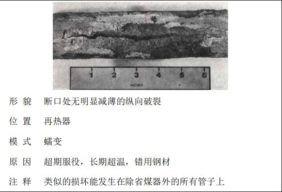

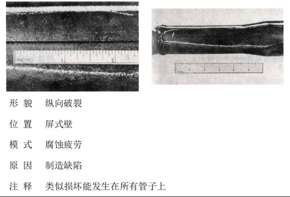

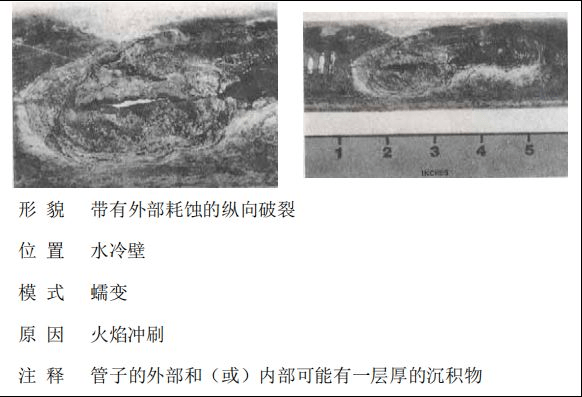

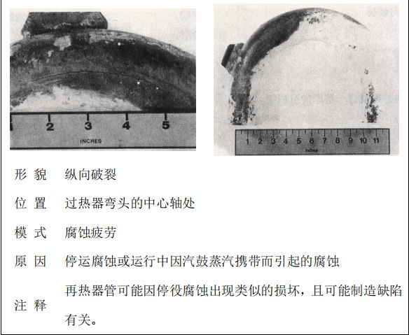

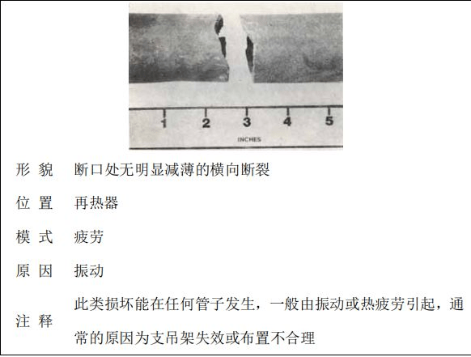

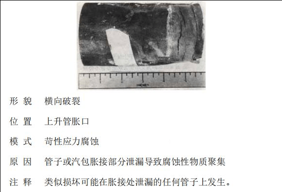

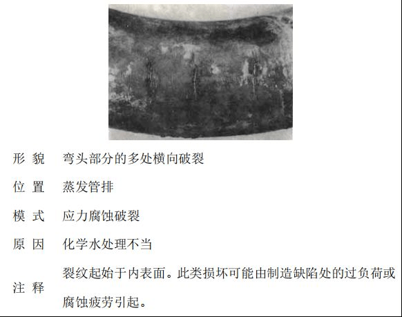

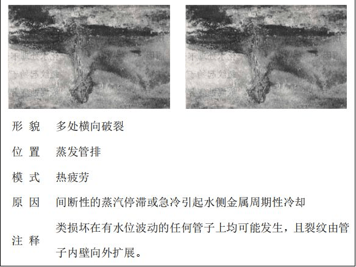

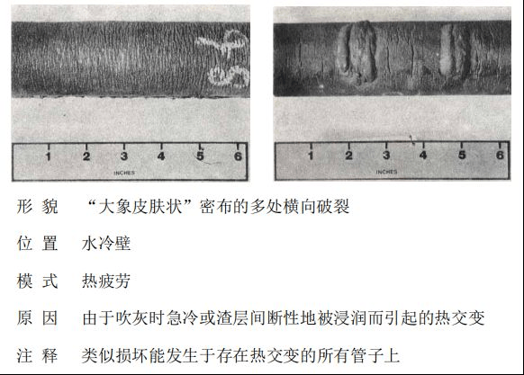

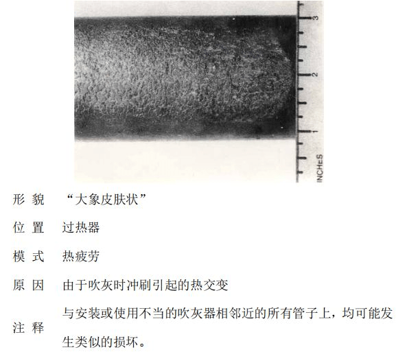

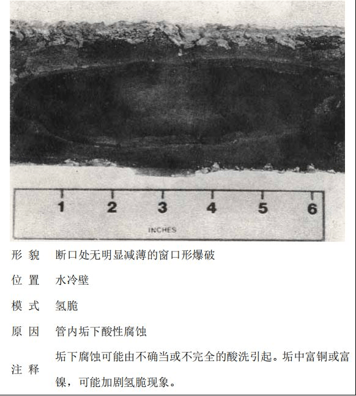

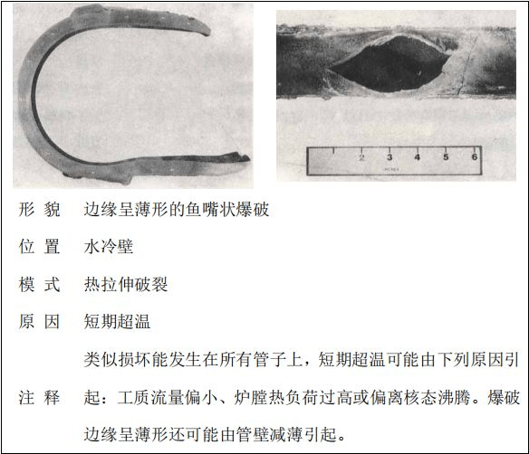

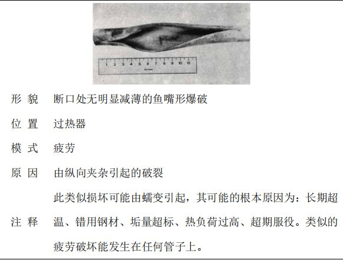

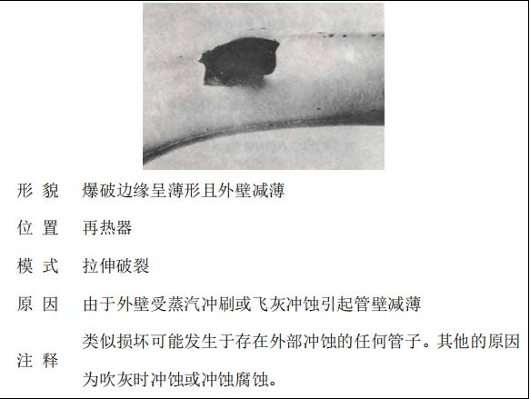

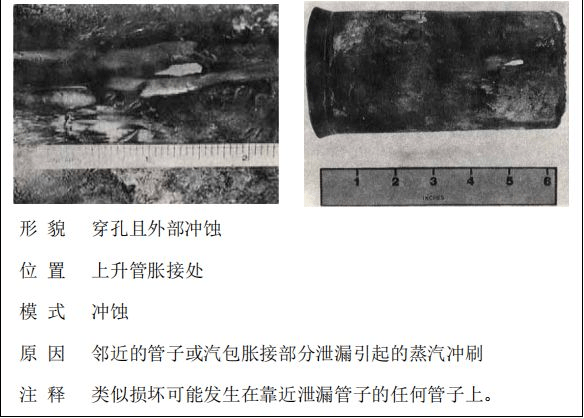

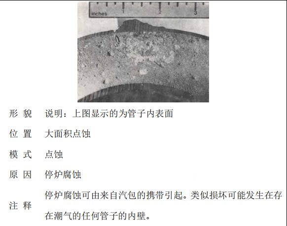

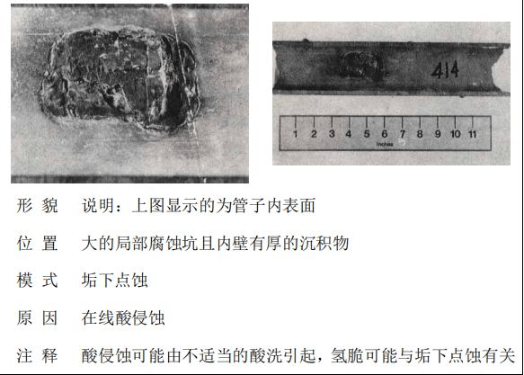

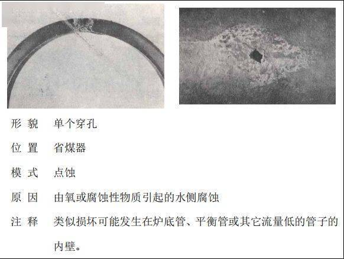

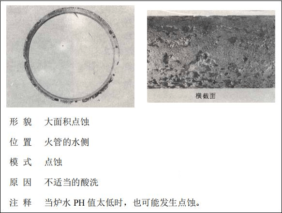

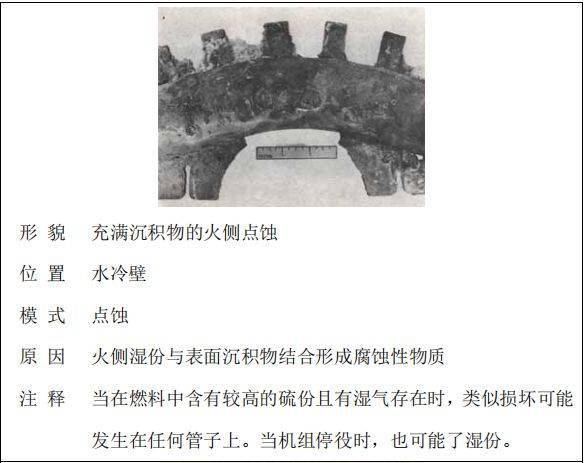

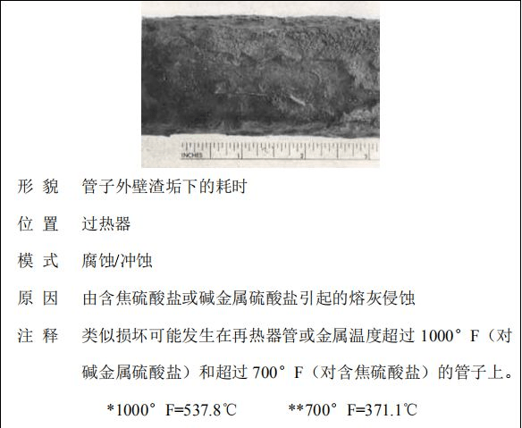

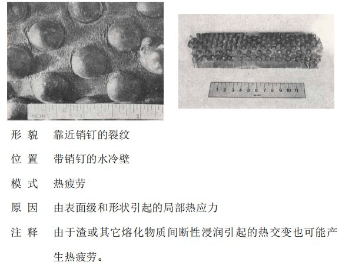

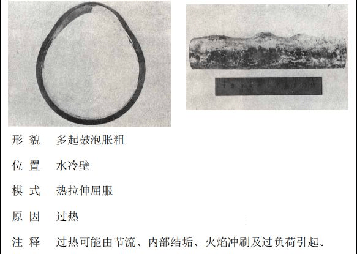

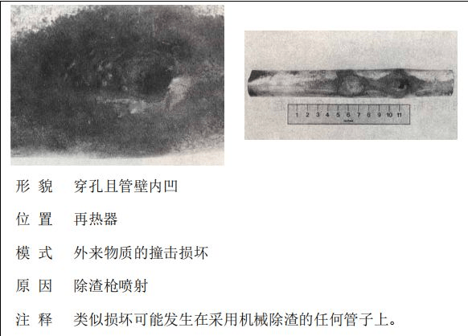

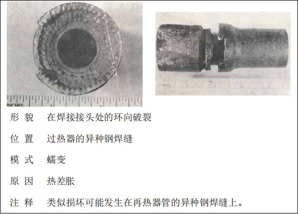

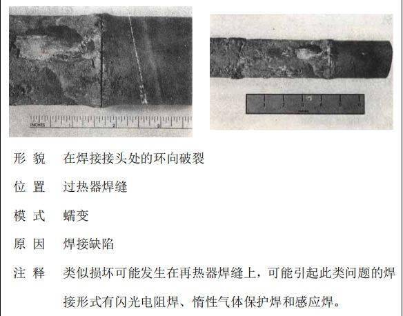

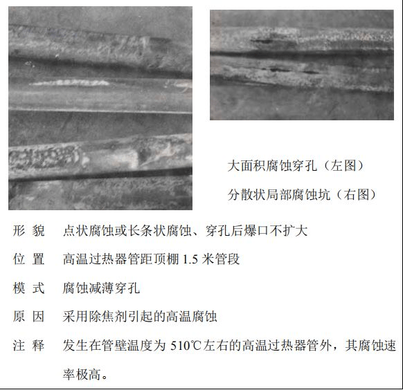

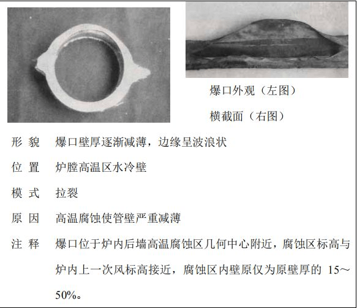

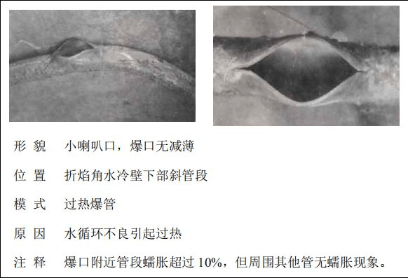
