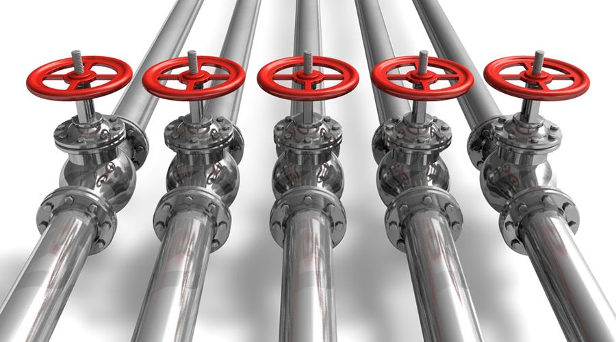
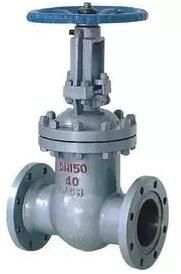
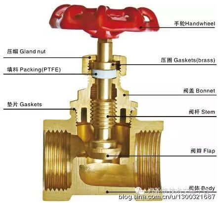
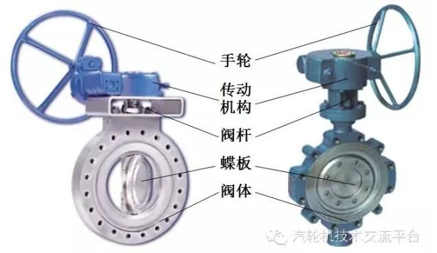
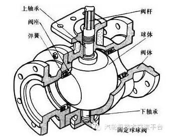
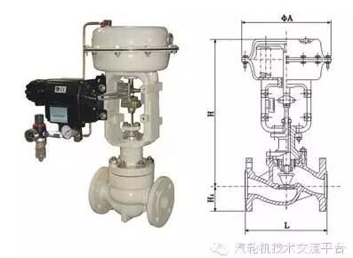
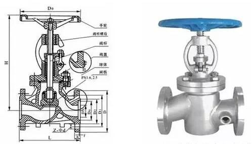
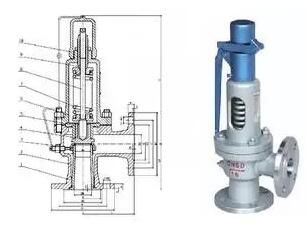
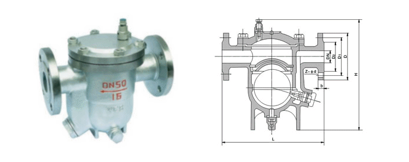

# 阀门种类

在火电厂中，配用阀门电动装置进行操作的阀门种类主要有闸阀、截止阀、蝶阀和球阀等。

阀门代号如下所示：

| 阀门类别 | 闸阀   | 截止阀 | 止回阀 | 节流阀 | 球阀   | 蝶阀   | 给水分配阀       | 减温减压阀   |
| -------- | ------ | ------ | ------ | ------ | ------ | ------ | ---------------- | ------------ |
| 代号     | Z      | J      | H      | L      | Q      | D      | F                | C            |
| 阀门类别 | 隔膜阀 | 安全阀 | 调节阀 | 旋塞阀 | 减压阀 | 疏水阀 | 水位计（平衡容器 | 减温减压装置 |
| 代号     | G      | A      | T      | X      | Y      | S      | B                | W            |

（1）闸阀的启闭件**是闸板形的，闸板沿着与流体流向相垂直的方向作直线运动，截断或开启流体流动的通道，它是火电厂中大口径管道上（Dg大于100mm）使用的主要阀门**。

闸阀的作用是利用阀瓣沿通路中心的垂直线方向移动来实现开启或关闭管道通路。闸阀的主要启闭零件是阀瓣和阀座。闸阀的构造主要由阀门、阀盖、支架、阀杆、阀座、闸板及其它零件组成。

闸阀按阀瓣的结构形状可分为楔式闸阀和平行式闸阀两大类。

根据闸阀启闭时阀杆运动情况的不同，闸阀又可分为明杆式和暗杆式两大类。

闸阀的特点和用途：闸阀的优点是流动阻力小，开闭较省力，不受介质流向的限制，介质可以两个方向流动，结构尺寸较小，全开时密封面受介质冲蚀小。缺点是结构复杂，高度尺寸较大，开启需一定的空间，开闭时间长，开闭时密封面容易受冲蚀和擦伤。

闸阀的应用范围是由其特点决定的，一般用于公称通径大于100mm的管道上，作切断作用。

（2）截止阀的启闭件是**塞形的阀瓣**，阀瓣上下作直线运动，去截断或开启流体流动的通路。它是火电厂中使用得较多的一种阀门，*D*g在100mm以下的管道上几乎全部使用截止阀。

截止阀的阀瓣由平面和锥面等密封形式。

截止阀的特点和用途：截止阀的特点是操作可靠，开启高度小，关闭严密，启闭时间短，易于调节或截断流量。但其流体阻力大，开启、关闭力较大，且随着通道截面积的增大而迅速增加，制成通路截面积较大而又十分可靠的截止阀是很困难的，因此，截止阀一般口径在200mm以下，主要应用于蒸汽管道上，主要用来切断管道介质用。截止阀有方向性，安装必须注意。

（3）蝶阀的启闭件**是一个圆盘形的蝶板，它通过围绕座内的轴旋转来开启与关闭阀门，蝶板从全开到全关的旋转角度通常小于90度，蝶阀不适用于高温高压介质。**

蝶阀主要由阀体、阀门板、阀杆与驱动装置组成，旋转手柄使驱动装置带动阀门板绕阀体内一固定轴旋转，由转动角度大小来达到启闭和节流目的。蝶阀的特点是结构简单，重量轻，维修方便。在电厂中，多用于低温低压的循环水管道系统中。

（4）球阀的启闭件**是一个有孔的球体，球体以阀体中心线为轴作旋转运动，来截断或开启流体流动的通道**。阀门从全开到全关，阀杆的旋转角为90度。球阀适用于高压介质，但工作温度有一定限制。

（5）调节阀

通过**阀瓣的旋转或升降改变通道截面积**，从而改变介质流量和压力的阀门叫调节阀。按工作原理可分为回转式调节阀和升降式调节阀。

（6）止回阀

又称**逆止阀或单向阀，主要用途是靠介质的力量自动关闭阀瓣**，防止管道内的介质倒流，避免事故发生。它广泛用于各类泵的出口管路、给水管路、抽汽管路、疏水管路，以及其它不允许介质倒流的管路上。按结构分为升降式、旋启式和蝶式。

（7）安全阀

**安全阀是一种保护类阀门用于各种承压容器和管路系统上，以防压力过分升高超过规定数值时，能自动开启，将过剩的介质排放到低压系统或大气中去，将压力降低，使设备免于破坏，当压力恢复到规定数值时安全阀又能自动关闭。**

安全阀的按作用是在阀瓣上的载荷型式可分为弹簧式、杠杆重锤式脉冲式和液压控制式等几种。

按开启高度的不同分为微启式和全启式。

（8）疏水阀

疏水阀的作用是能**自动、间歇排除蒸汽管道及蒸汽设备系统中的冷凝水并能防止蒸汽泄出**。

# **阀门检修一般质量标准**

| 项目             | 质量标准                                                     | 备注                   |
| ---------------- | ------------------------------------------------------------ | ---------------------- |
| 填料压盖         | 无变形，与门杆间隙0.1－0.2mm，装配间隙均匀，压盖螺栓紧力均匀 |                        |
| 填料             | 无破损，切口成45°斜角，各层搭接错口120°－180°，压盖余量＞15mm | 目前多采用柔性石墨填料 |
| 门杆             | 弯曲度不超过0.1－0.25mm，椭圆度不超过0.02－0.05mm，光洁面无锈蚀、磨损、腐蚀，门杆螺纹完好，与门杆螺母配合灵活不松旷 |                        |
| 阀芯、阀座密封面 | 表面光洁、红丹靠研密封线连续均匀不断线                       |                        |
| 四合环           | 表面光滑、平行度符合规定，与阀体间隙合适                     |                        |
| 压圈             | 表面光滑，无变形，无腐蚀                                     |                        |
| 螺栓             | 数量齐全，螺母、螺栓配合灵活；合金钢螺栓硬度符合要求         |                        |
| 传动装置         | 电动装置：手动、电动切换灵活，电动限位可靠，内部润滑良好，轴承及丝母转动灵活，无损伤，与门杆配合灵活。气动装置：隔膜无破裂，气缸无渗漏，各弹簧无变形、裂纹 |                        |
| 水压试验         | 符合水压试验要求                                             |                        |
| 调试             | 阀门全行程开关灵活，限位动作正确，信号传递准确               |                        |

# **阀门常见故障、原因及消除方法**

| 序号 | 故障名称                                           | 产生原因                                                     | 消除方法                                                     |
| ---- | -------------------------------------------------- | ------------------------------------------------------------ | ------------------------------------------------------------ |
| 1    | 阀体渗漏                                           | 1．阀体有砂眼或裂纹2．阀体补焊时拉裂                         | 1．对怀疑裂纹处磨光，用4％硝酸溶液浸蚀，如有裂纹就可显示出来2．对裂纹处进行挖补处理。 |
| 2    | 阀杆及与其配合的丝母螺纹损坏或阀杆头折断、阀杆弯曲 | 1．操作不当，开关用力过大，限位装置失灵，过力矩保护未动作。2．螺纹配合过松或过紧3．操作次数过多、使用年限过久 | 1．改进操作，不可用力过大；检查限位装置，检查过力矩保护装置2．选择材料合适，装配公差符合要求3．更换备品 |
| 3    | 阀盖结合面漏                                       | 1．螺栓紧力不够或紧偏2．垫片不符合要求或垫片损坏3．结合面有缺陷 | 1．重紧螺栓或使门盖法兰间隙一致2．更换垫片3．解体修研门盖密封面 |
| 4    | 阀门内漏                                           | 1．关闭不严2．结合面损伤3．阀芯与阀杆间隙过大，造成阀芯下垂或接触不好4．密封材料不良或阀芯卡涩 | 1．改进操作，重新开启或关闭2．阀门解体，阀芯、阀座密封面重新研磨3．调整阀芯与阀杆间隙或更换阀瓣4．阀门解体，消除卡涩5．重新更换或堆焊密封圈 |
| 5    | 阀芯腐蚀损坏                                       | 阀芯密封材料选择不当                                         | 1．按介质理化性质，选择合格的密封材质2．更换合乎要求的阀门   |
| 6    | 阀芯与阀杆脱离，造成开关失灵                       | 1．修理不当2．阀芯与阀杆结合处被腐蚀3．开关用力过大，造成阀芯与阀杆结合处被损坏4．阀芯止退垫片松脱、连接部位磨损 | 1．检修时注意检查2．更换耐腐蚀材质的门杆3．操作是不可强力开关，或不可全开后继续开启4．检查更换损坏备品 |
| 7    | 阀芯、阀座有裂纹                                   | 1．结合面堆焊质量差2．阀门两侧温差大                         | 对有裂纹处进行补焊，按规定进行热处理，车光、并研磨           |
| 8    | 阀杆升降不灵或开关不动                             | 1．冷态时关得太紧受热后胀死或全开后太紧2．填料压得过紧3．阀杆间隙太小而胀死4．阀杆与丝母配合过紧，或配合丝扣损坏5．填料压盖压偏6．门杆弯曲7．介质温度过高，润滑不良，阀杆严重锈蚀 | 1．对阀体加热后用力缓慢试开或开足并紧时再稍关。2．稍松填料压盖后试开3．适当增大阀杆间隙4．更换阀杆与丝母5．重新调整填料压盖螺栓6．校直门杆或进行更换7．门杆采用纯净石墨粉做润滑剂 |
| 9    | 填料泄漏                                           | 1．填料材质不对2．填料压盖未压紧或压偏3．加装填料的方法不对4．阀杆表面损伤 | 1．正确选择填料2．检查并调整填料压盖，防止压偏3．按正确的方法加装填料4．修理或更换阀杆 |

  