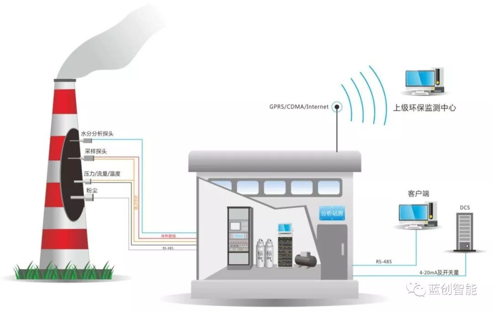

烟气在线监测系统也就是固定污染源烟气连续排放的污染物浓度连续自动监测设备。其监测数据实时反应生产情况，为生产运行人员操作设备提供依据，也为环保部门提供排放监测信息。同时CEMS数据也是国家排污费税收取以及相关环保处罚的一个重要依据，因此CEMS的运行稳定性至关重要。

# **CEMS系统的运行原理**

烟气在线监测系统（CEMS）是许多大型工厂正常运行和环保数据监测传输的重要在线监测系统，主要应用在火力发电、供热锅炉、水泥建材和金属冶炼等行业。CEMS主要由烟气成分分析单元，烟尘浓度监测单元，流量监测单元，数据采集、处理及控制单元组成。主要监测参数为SO2、NOx、O2以及烟气流速、温度、压力、湿度、粉尘浓度等。

其运行原理是通过加热抽取法（抽取冷凝法）将烟道中气体取出并输送到预处理单元，预处理单元将烟道中的气体经预处理后送入分析仪表。通过在线气体分析仪表（烟气分析仪）对烟气中多种污染物进行连续监测，将测量数据显示在仪表上，最后通过数采仪或VPN将监测数据实时传到环保监控网络。

# **CEMS维护过程中的注意事项**

为保证CEMS测量数据准确可靠，每天巡视检查CEMS各设备的工作情况，查看历史数据和数据报表，及时发现和排除设备存在的异常，提高系统的可靠性。需要做好以下日常维护保养工作：

## 加热装置和制冷装置

加热装置和制冷装置是保护烟气分析仪的重要设备，是日常巡视和维护的重点关注对象。加热装置温度一般控制在130℃左右，在没有加热的情况下，烟气中水分进入分析仪，造成滤芯堵塞，分析仪损坏等，同时管路中形成酸雾，直接影响测量结果；制冷装置温度一般控制在4℃左右，如果冷凝器温度只能达到6℃及以上时需要进行维修或者更换。

## 蠕动泵检查

蠕动泵用于排出制冷器冷凝筒内的水和密封取样气路。如果蠕动泵长时间不工作，冷凝水会进入采样泵和分析仪，造成设备损坏。

## 反吹系统检查

反吹系统检查时，检查反吹气源压力是否在正常范围内。手动反吹时，将系统切至维护状态进行反吹。自动反吹是在PLC控制系统中设置好反吹时间并将测量数据进行保持，不会因反吹而发生控制系统调节异常或者设备损坏。

## 烟气分析仪的定期标定

烟气分析仪需要定期进行零点和量程标定。CEMS监测站房都配有每种被测介质因子的高中低三种浓度的标准气体和高纯氮，标定完毕通入另一浓度的标准气进行比对。标定周期为每半年至少一次。自动零点校准根据现场设备实际情况设置为8-12个小时自动进行一次零点标定，避免出现零点漂移，保证分析测量的准确性。

## 参数量程的一致性

在分析仪和标准气体的选择方面要注意，分析仪量程要根据烟气中所测介质因子的设计浓度来选择，量程不应超过污染源排放允许限值的两到三倍，保证烟气分析仪所测量数据的准确度；标准气体的选择要根据分析仪的量程和所测介质因子通常浓度来选择，不宜过高或者过低（量程的80%-100%以内）。上位机、PLC及数据采集仪的量程设置应保持一致。

# **运行过程中常见故障及解决方法**

烟气在线监测系统作为一个重要监控系统，其复杂程度不小，系统内部环环相扣，每一个小故障都可致整个系统出现大问题。

## 温度、压力、流量、湿度数据异常

检查相应的测量元件是否正常，取样管路是否畅通。

## 颗粒物测量值异常

检查粉尘仪电源是否正常、粉尘仪是否损坏；检查探头镜片是否洁净，否则进行清洁处理；吹扫压缩空气是否正常投入。

## 样气流量异常

流量异常一般是流量低于正常值或无流量显示。检查转子流量计是否存在卡塞；转子流量计正常，则检查整个取样管路是否漏点或堵塞。

## 数据异常的原因分析及处理

根据监控系统流程，任一环节故障均会导致测量数据异常。当出现数据异常的情况，根据实际情况，做出初步判断，从故障可能性最大的部件开始进行逐项排查，直至设备运行正常。

## **烟气分析仪显示氧量超过或者低于正常值**

出现氧量测量值高出正常值时，检查取样管路是否存在泄漏；氧量低或者无显示时检查氧量传感器是否正常，否则予以更换。

## **烟气分析仪故障**

烟气分析仪损坏除设备老化以外，多为样气预处理不好导致。对分析仪进行维修或更换，同时需检查采样管线加热情况和预处理设备工作情况。

## **烟气分析仪零点或量程漂移**

烟气分析仪的零点或量程漂移不会直观表现出来，只能通过比对分析，判断是否出现零点或量程漂移。

## **气路中的水分含量大**

检查取样探头及伴热管线加热装置工作是否正常；反吹取样管路，排除管路中的水分。

随着环境保护工作及绿色低碳发展要求日益受到全社会的重视，CEMS作为对固定源烟气排放污染物浓度的连续自动监测系统，也越来越得到石化行业、冶金行业、焦化行业等广泛使用。